<div align="center">
  

# 弦予音乐 · 移动端
## (XianYu-Music-Mobile)

弦予音乐的移动端（Android / 鸿蒙 / iOS）：本地曲库 + 插件音源扩展，专业音频引擎与 30+ 音效 DSP、逐字歌词、液态玻璃 UI，手机上的沉浸式听歌体验。软件不内置音乐内容，插件由用户自行安装。

 [](https://flutter.dev/)
 [](https://www.rust-lang.org/)
 [](https://dart.dev/)

[](./LICENSE)

</div>

## ✨ 功能亮点

- 🎨 **高颜值液态玻璃 UI**

  - **液态玻璃质感**：自研液态玻璃着色器，半透明磨砂设计与系统环境自然融合（鸿蒙端受引擎限制自动降级为毛玻璃，非故障）。
  - **Material 3 动态取色**：支持浅色 / 暗色 / 跟随系统，主题强调色可自定义（默认网易云红 `#EC4141`）。
  - **沉浸式播放页**：封面液态网格渐变背景随曲目色彩动态演变，实时频谱可视化，切歌封面飞入动效。

- 🎧 **专业音频引擎**

  - **全格式解码**：基于 `symphonia`，支持 MP3 / FLAC / AAC / ALAC / OGG / Vorbis / WAV / AIFF。
  - **倍速播放**：0.5~2.0 倍速变速不变调，播客 / 有声内容友好。
  - **QMC2 解密**：内置加密格式解密，插件源加密资源直接播放。
  - **USB 独占输出**：Android 端 AAudio `EXCLUSIVE` 模式直连 USB DAC，绕过系统混音器，bit-perfect 输出。

- 🎚️ **全 Rust 音效 DSP**

  - **完整音效链**：响度归一化 → 10 段 EQ（自定义预设保存 / 重命名 / 删除）→ 音效 → 音量 → 限幅，独占 / 共享模式管线一致。
  - **30+ 音效**：FFT 卷积混响、常数功率交叉淡入、变速不变调（OLA 相位声码器）、3D / 8D / 36D 环绕（转速 / 距离 / 声场可调）、重低音增强与动态低音回弹等。
  - **实时频谱**：环形缓冲 + 4096 点 FFT + 时间平滑，低开销高帧率。

- 📱 **平台原生体验**

  - **原生手势**：Android Predictive Back 预测性返回、下拉返回等系统级手势与转场，不做自绘转场，省电且跟手。
  - **横屏 / 平板适配**：响应式双栏布局，横屏播放页与竖屏布局自动切换。
  - **播放队列管理**：队列面板拖拽排序、「下一首播放」插队不打乱原队列。
  - **后台播放**：系统媒体通知 + 锁屏控制，后台稳定续航。
  - **应用内反馈**：登录后一键提交，附带错误日志 / 全量日志 / 截图。
  - **本地音乐库**：`rayon` 并行扫描、标签解析、封面提取与调色板、增量差异更新。

- 🌐 **远程与投放**

  - **双格式插件**：兼容 MusicFree / LX 落雪插件，QuickJS 沙箱执行，HTTP 请求经 Rust 代理无 CORS 限制。
  - **播放失败自动降级**：起播失败行为可配，在线播放失败自动在其他落雪音源搜索并播放同一首歌，默认音质失败自动切换音质档位。
  - **云端同步**：歌单 / 收藏 / 插件 / 设置多端同步，自动同步调度；冲突可选择性处理（设置同步提供保留本地 / 云端选择）。
  - **本地全量备份**：歌单 / 收藏 / 插件 / 设置一键导出 JSON 备份（带 schema 版本）。
  - **WebDAV 远程音源**：远程曲库扫描、LRU 缓存、流式播放。
  - **下载与转码**：歌曲下载与音频格式转换（toolbox），加密源解密落盘。
  - **Deep Link 分享**：外部分享歌曲 / 歌单链接直接唤起播放，支持「下一首播放」插入。
  - **歌词**：QRC / LYS / YRC 逐字歌词，AMLL 风格渲染，本地缓存 + 远程获取；悬浮歌词（字体 / 颜色 / 位置 / 翻译 / 罗马音可配）、状态栏歌词，点击歌词行跳转进度。

- 🧭 **个性化与统计**

  - **每日推荐**：本地化推荐算法，按听歌偏好生成每日歌单。
  - **听歌统计**：播放次数 / 时长累计，独立模式下完整记录。

- 📦 **极致体积**

  - 安装包仅 **~17MB**：`.so` 包内压缩 + Dart AOT 混淆 + R8 收缩 + thin LTO，安装时自动解压。

---

## 📸 界面截图

**竖屏**

| 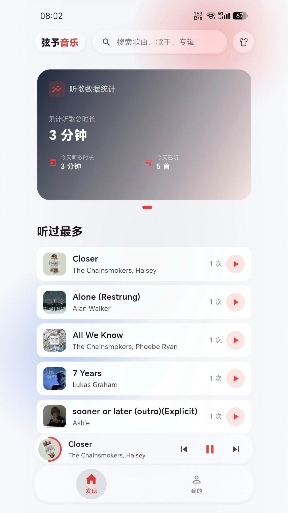<br/>首页 | 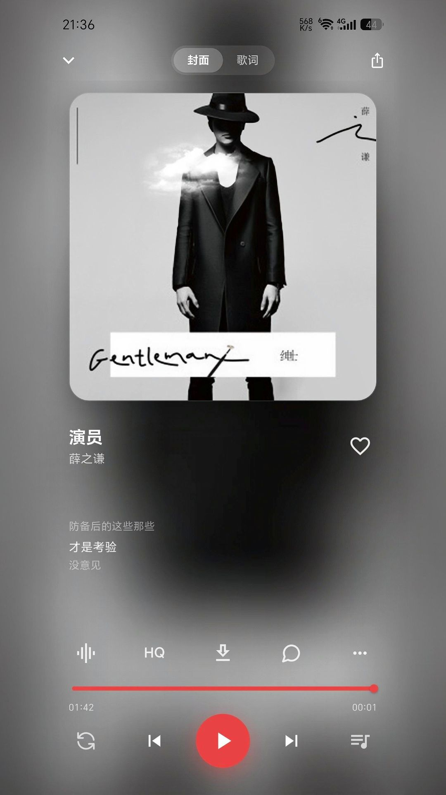<br/>播放页封面 | 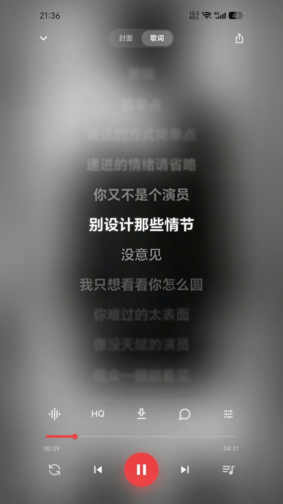<br/>歌词 |
|:---:|:---:|:---:|
| <br/>通知栏控制 | 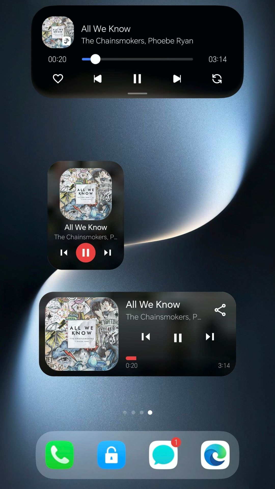<br/>桌面组件 | 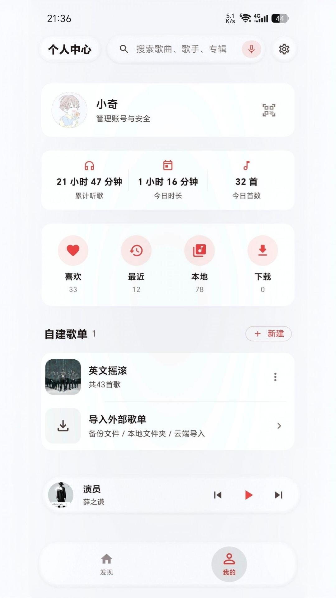<br/>我的 |
| 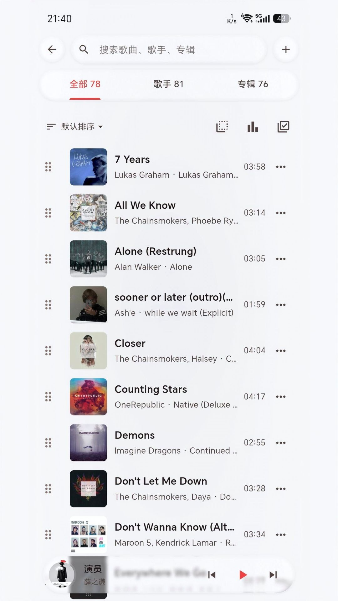<br/>本地音乐 | 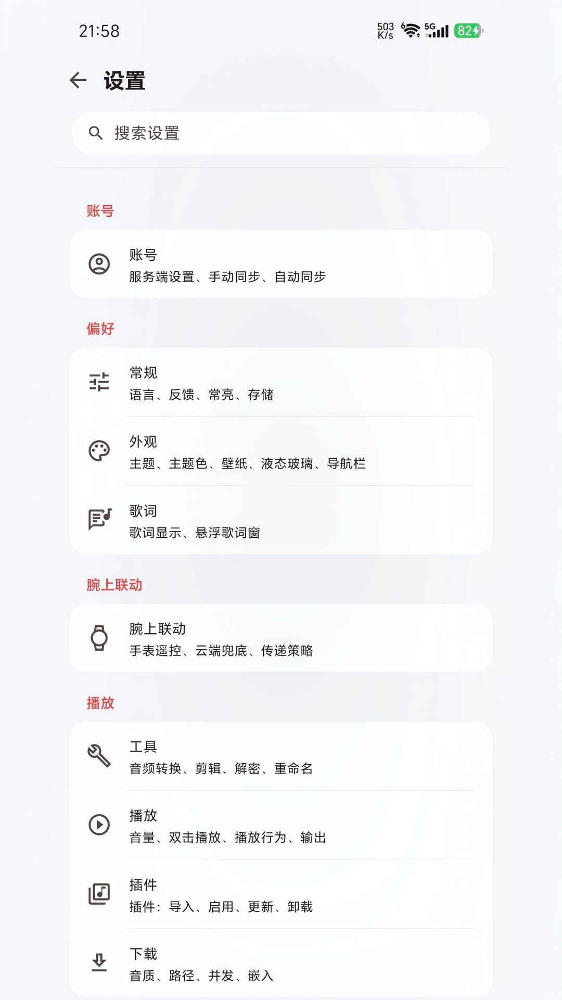<br/>设置 | | 

**横屏**

| 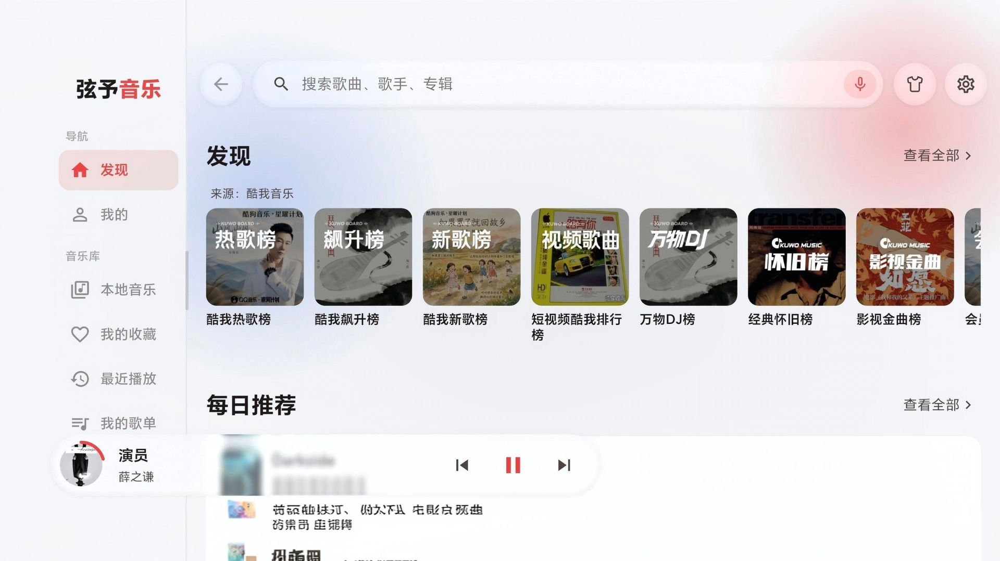<br/>发现 | 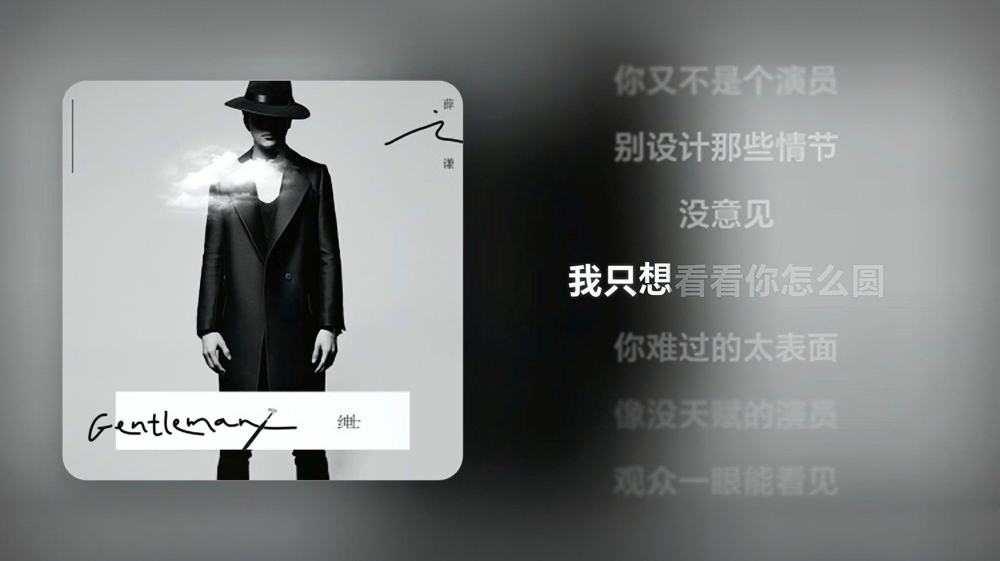<br/>沉浸播放 | 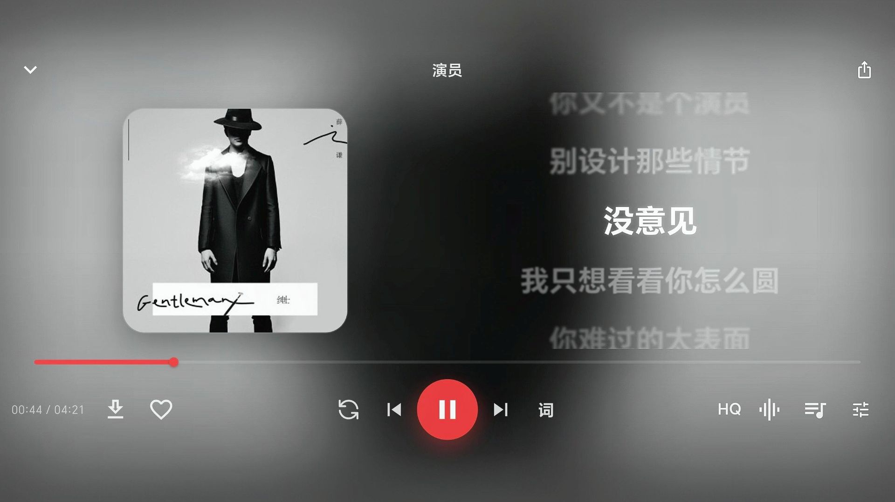<br/>歌词 |
|:---:|:---:|:---:|
| 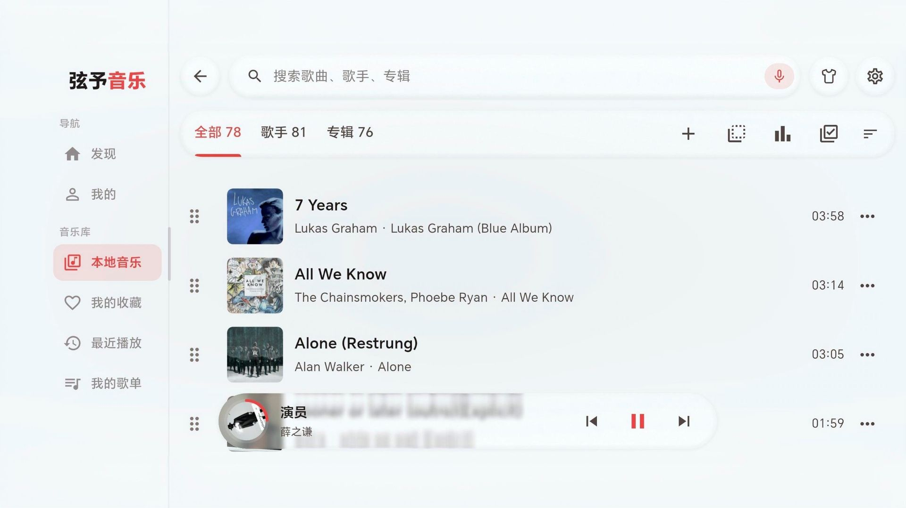<br/>本地音乐 | 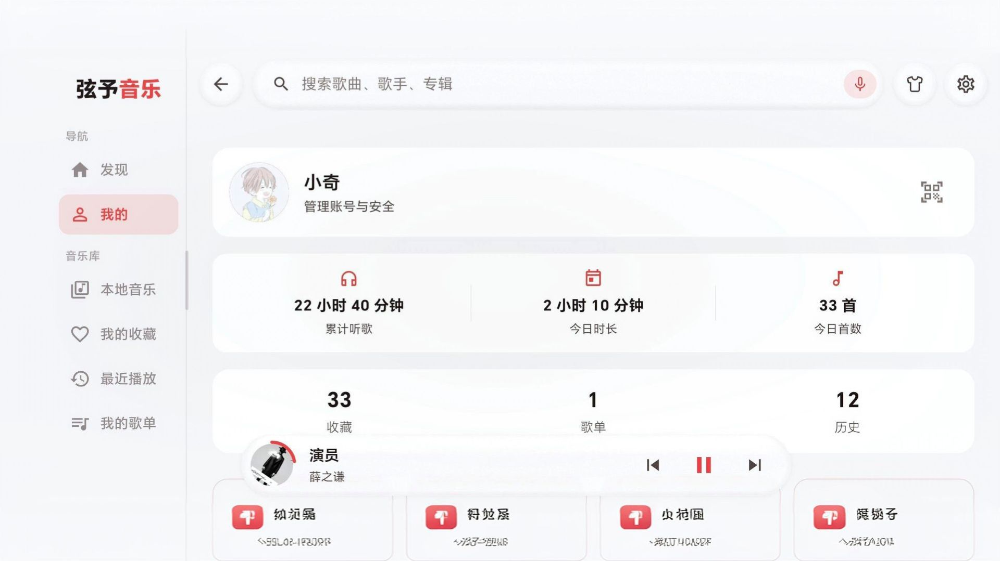<br/>我的 | 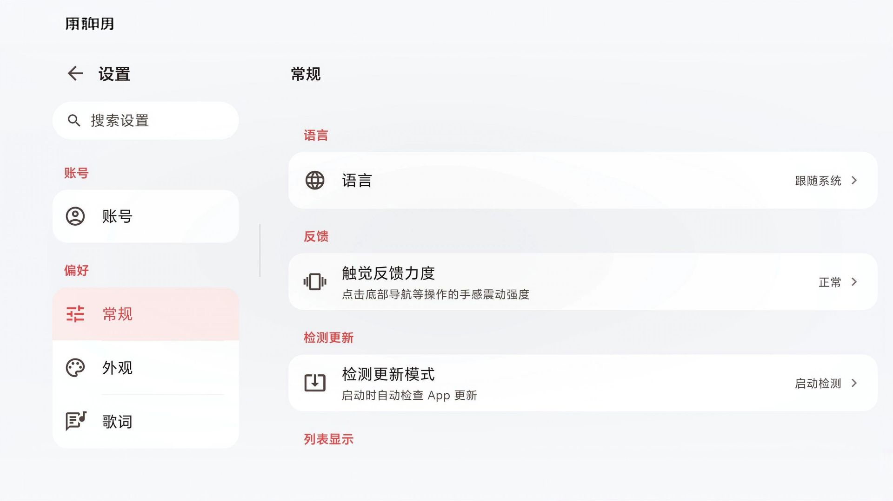<br/>设置 |

---

## 🛠️ 使用源码构建运行

### 环境要求

| 依赖项 | 要求 |
| --- | --- |
| **Flutter** | `3.47.0+`（Dart `3.13.0`） |
| **Rust** | Stable + `cargo ndk`（构建钩子自动调用） |
| **Android** | Windows 10/11 + Android SDK / NDK（API 36 编译，NDK r27+），真机开 USB 调试 |
| **iOS** | macOS + Xcode + CocoaPods，`rustup target add aarch64-apple-ios aarch64-apple-ios-sim` |
| **鸿蒙** | DevEco Studio 6+、Flutter-OH fork（`scripts/ohos/env-ohos.ps1` 绑定工具链）、`rustup target add aarch64-unknown-linux-ohos x86_64-unknown-linux-ohos` |

### 运行与调试

```bash
git clone https://github.com/TaXiaoQi/XianYu-Music-Mobile.git
cd XianYu-Music-Mobile
flutter pub get

flutter run          # Android 调试（或 .\scripts\dev.ps1：同步版本号 + 编 Rust + run）
flutter hap          # 鸿蒙调试运行
```

> `flutter run` / `flutter build` 均自动检测并编译 Rust（`XIANMU_SKIP_RUST=1` 跳过）；改 Rust API 时首次构建会中止，重跑一次即可。热重载按 `r`，热重启按 `R`。

### 构建各平台安装包

```bash
# Android（.apk）
flutter build apk --release

# iOS（未签名校验构建，归档 / 签名走 Xcode）
cd ios && pod install && cd ..
flutter build ios --release --no-codesign

# 鸿蒙（.hap / .app）
flutter build hap                        # 安装包（真机/模拟器通吃）
flutter build app                        # 商店包（AppGallery 上架用）
.\scripts\ohos\build-ohos.ps1            # 全自动：编 Rust + 构建 + 归档 releases\ohos
.\scripts\ohos\build-ohos.ps1 -AppPack   # 同上 + 出上架 .app
```

- 产物自动归档到 `releases/`：`弦予音乐v<版本>-Mobile-<架构>.apk/.hap`（版本号取自 `version.ts`）；混淆符号归档到 `releases/symbols/<版本>/app.symbols`
- 鸿蒙构建期间必须**完全关闭 DevEco Studio**（会回写配置清掉签名材料）；装机 `hdc install -r <HAP>`
- 鸿蒙上液态玻璃自动降级为普通毛玻璃（Flutter-OH 引擎无 Impeller 后端），待引擎支持后同一份代码自动恢复

---

## 📐 技术架构

移动端采用 Flutter + Rust 双层架构：Flutter 负责 UI 与状态，Rust 核心（`xianyu_core`）负责音频引擎、音乐库、插件运行时等高性能计算，两者通过 [flutter_rust_bridge](https://github.com/fzyzcjy/flutter_rust_bridge) 类型安全桥接，Rust 代码与桌面端同源复用。

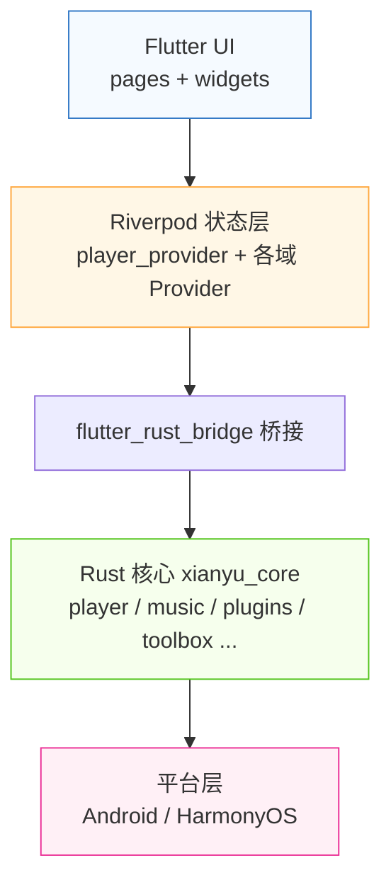

### 模块划分

| 层级 | 模块 | 职责 |
| --- | --- | --- |
| **UI** | `lib/pages/`、`lib/src/navigation/` | 24 个功能页域 + 主壳（底部导航、固定顶栏/底栏、播放条、飞封面转场） |
| **UI** | `lib/src/widgets/` | 共享组件：液态玻璃体系、毛玻璃渲染预算、弹窗/Toast/滑条等 |
| **状态** | `lib/src/player/player_provider.dart` | 播放状态中枢：队列管理、音效链控制、USB 独占、联动/独立模式热切换 |
| **状态** | `lib/src/{library,search,playlist,sync,plugin,download,auth,...}` | 各业务域 Provider 与数据仓库 |
| **Rust** | `rust/src/player/` | 音频引擎：BufferedSource → 响度归一化 → EQ → 音效 → 插件宿主 → 用户音量 → 限幅效果链；AAudio 共享 / USB `EXCLUSIVE` 双输出；QMC2 / CENC 解密 Reader |
| **Rust** | `rust/src/music/` | 音乐库：rayon 并行扫描、标签/封面解析、SQLite 持久化、三端同源归一化搜索（NFKC + NFKD + 繁转简）、URL 解析、歌词获取 |
| **Rust** | `rust/src/plugins/` | 插件扩展：MusicFree / LX 落雪双格式运行时、插件 HTTP 代理（无 CORS 限制）、SSRF 防护与路径校验（`security/`）、插件包存储 |
| **Rust** | `rust/src/{toolbox,database,dlna,remote,statistics,recognize,audio_convert}` | 下载（ekey 透传）、SQLite 数据层、DLNA 投放、WebDAV 远程音源、听歌统计、听歌识曲、音频转码/裁剪 |
| **桥接** | `rust/src/api/` | flutter_rust_bridge 集中桥接层，所有跨语言命令的唯一出入口 |
| **平台** | `android/`、`ohos/` | Android：媒体前台服务（MediaSession + 通知）、WatchLink 蓝牙服务端、预测性返回；鸿蒙：屏形探测通道、表冠事件分发（RotaryDispatcher）、连续任务保活、返回链路收口 |

### 关键机制速记

- **双模式启动**：联动模式（外置控制端，跳过 12MB 原生库映射等重模块）与独立模式（完整服务）进程内热切换，无需重启。
- **加密源直放**：插件返回的 `ekey` / `cek` 全链路透传，QMC2 / CENC 解密 Reader 流式解密，不解落盘。
- **USB 独占**：AAudio `EXCLUSIVE` 模式直连 USB DAC，绕过系统混音器 bit-perfect 输出。
- **三端同源搜索**：与桌面/腕上端同一套归一化搜索与关键词联想（Rust 层单实现）。
- **腕上联动**：`watch_link` 作为 RFCOMM 服务端，向手表推送 state / now_playing / position / lyric 帧。

---

*更新日期：2026-09-11*
